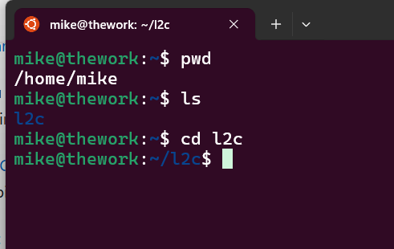

DevSecOps #1: CLI and Git basics


For Day 1 of DSO, I decided to follow this [guide](https://learntocloud.guide/phase1/versioncontrol) and setup my workstation with WSL. 

I follow this tutorial https://learn.microsoft.com/en-us/windows/wsl/tutorials/wsl-vscode

 - Download VSCode
 - Download the Remote Development extension pack
 - Open Ubuntu, create a user and password

Now my WSL environment is setup for my workstation.

Next, the guide needs us to create a new directory, so using ```mkdir l2c``` we create a new directory and ```cd``` into it.



Next we clone the l2c challenges locally using this command :

```git clone https://github.com/rishabkumar7/ltc-labs ```


There are some questions at the end:
- What is version control?
	-  Version Control is literally controlling the versions of files. In other words, changes are saved to a repository, meaning you can roll back to a previous version of the file if need be. 
- What is markdown?
	- Markdown is a markup language that allows you to have formatting and HTML style features without needing to actually write HTML. 
- What is a git repository?
	- A Git repository is a storage for all of your code/files that supports version control. 
- What does it mean to clone a repository?
	- To clone a repository means to make a copy of the code and its files and download them to your machine.
- git should be installed on your computer (done)
- vs code should be installed on your computer (done)
- WSL should be setup for Windows users (done)
- You created a folder on your computer with the terminal and `mkdir` command (done)
- The lab repo should be cloned locally on your computer (done)
- Your README repo should be cloned locally on your computer (done)
