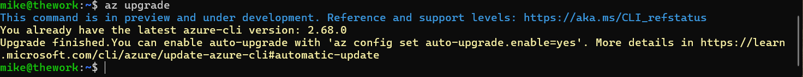
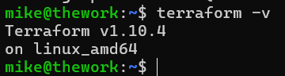

DevSecOps #2:

I like the structure of the Learn2Cloud guide, so I am continuing to follow it.

Next we work on[ Cloud CLI setup](https://learntocloud.guide/phase1/cli).

While I built my blog on AWS, I want to dive deeper into Azure since that is what we use at work.

I am generally familiar with the Azure Portal but I want to get better at using the CLI to complete tasks.

Since we set up WSL in the last blog, it makes sense to now [setup Azure CLI access through WSL](https://learn.microsoft.com/en-us/cli/azure/install-azure-cli-linux?pivots=apt).

I realize I should probably update everything on my machine so I run ```sudo apt-get update && sudo apt-get dist-upgrade``` to get a list of updates and upgrade everything.

Next I run this command from Microsoft:

``` curl -sL https://aka.ms/InstallAzureCLIDeb | sudo bash ``` 

(generally speaking you should read and investigate all scripts that you did not write yourself)

Once installed, I do a quick check with `az upgrade` just to be sure the latest version is installed.



The AZ CLI is very powerful and allows me to automate tasks programmatically. At this moment, I do not need to do this, but it is good to have it set up. The next step will be to connect the cli to my Azure subscription.

`az account show` shows the account details for my Azure subscription and while I won't display that here, it is currently working as expected.

- What is a CLI?
	- A command line interface allows a user to access files and execute commands via a text interface in what's called a terminal. 
- The benefits of using a CLI vs a UI for cloud resource management.
	-  The biggest draw is for using a CLI is that it is more efficient and quicker. There is the added benefit of automating tasks as well.
- You created a cloud account (done)
- You installed a cloud cli (done)
- You configured the cloud cli with your account. (done)

## Infrastructure as Code

Combining this with the previous task since we are still getting things set up. Next is to learn about IaaC, or Infrastructure as Code.

We will be using Terraform since its the industry standard.

We can install Terraform from [this link](https://developer.hashicorp.com/terraform/install) within our WSL instance.



- What is Infrastructure as Code?

Infrastructure as Code is the process of adding coding practices to our deployment of infrastructure. 

For example, instead of trying to have someone remember what resources are deployed, we add version control. Perhaps one week we needed 20 VMs to serve our users, and then we added a new customer and now we need an additional 20 VMs. What if these users all work in different time zones? Now we can add automation to scale the infrastructure to match demand. What if we add more customers that require different regulatory practices? We can use the same code that we deployed for our other customers and deploy in a separate environment and reuse our existing code. 

- What is Terraform?
Terraform is a IaC offering from Hashicorp to manage infrastructure through a declarative format. 

- Why use Terraform?
I took this question to mean why use Terraform vs not using it at all. In that regard, Terraform offers IaC that is cloud agnostic and has a declarative configuration, where you state _what_ you want and Terraform handles the _how_. It also offers version control, which in turn allows users to collaborate in managing infrastructure.
- Terraform should be installed on your computer (done)
- What does terraform init do?
Terraform init gets the latest status of the directory and also prepares it for use with Terraform. Its basically a startup function for Terraform and can be run multiple times to get the current working state of the directory.

- What does terraform apply do?

Terraform apply executes the changes proposed in a Terraform plan. In other words, the configuration that you desire for your environment will be made once Terraform Apply is run.


